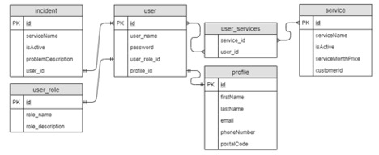

# Hibernate course project

> Console application

#### Requirements

1. Design a database according to the schema and implement relationships between entities (annotated classes) using
   hibernate

3. Self-define data types in tables. Table "user" - the user of the service. The user can have roles "USER", "ADMIN", "
   SUPER_ADMIN". Roles should be stored in the "user_role" table. "profile" - user profile, "service" - services used by
   users, "user_services" - a related table for "user" and "service", "incident" - an incident that occurred, a service
   breakdown (a ticket that a technical specialist must answer)
4. Relationships between hibernate entities and DB tables:
    - one "user" to one "profile";
    - one "user" to many "incident";
    - one "user" to one "user_role";
    - many "user" to many "service" (each user can use many services and at the same time each service can have many
      subscribed users)
5. When starting the application, carry out authorization with the input of username and password, the application
   searches the database, if there is a match, then we carry out user authorization
6. Receiving requests can be organized through the console, requests for which the application must respond:

| Request                                        | Description                                                                                                                                                                                                       | Access                         |
|------------------------------------------------|-------------------------------------------------------------------------------------------------------------------------------------------------------------------------------------------------------------------|--------------------------------|
| fetch_all_users                                | display in the console a list of all users with all dependencies                                                                                                                                                  | «ADMIN», «SUPER_ADMIN»         |
| fetch_all_incidents fetch_all_active_incidents | display in the console a list of all incidents and corresponding users without dependencies                                                                                                                       | «ADMIN», «SUPER_ADMIN»         |
| fetch_user_by_{id}                             | display in the user console by id with all dependencies, {id} — "id" parameter                                                                                                                                    | «ADMIN», «SUPER_ADMIN»         |
| add_user                                       | create a new user with a profile - give the status of the completed operation to the console, display auxiliary messages for entering all user and profile fields                                                 | «ADMIN», «SUPER_ADMIN»         |
| update_user_{id}                               | update some data of the current user by id with a profile - give the status of the completed operation to the console, display auxiliary messages for entering all user and profile fields, {id} - "id" parameter | «ADMIN», «SUPER_ADMIN»         |
| delete_user_{id}                               | delete user by id with all dependencies - give status to console                                                                                                                                                  | «ADMIN», «SUPER_ADMIN»         |
| subscribe_service_{id}                         | subscribe to the service, {id} - "id" parameter                                                                                                                                                                   | «ADMIN», «SUPER_ADMIN», «USER» |
| unsubscribe_service_{id}                       | unsubscribe to the service, {id} — "id" parameter                                                                                                                                                                 | «ADMIN», «SUPER_ADMIN», «USER» |
| create_incident                                | create an incident (ticket)                                                                                                                                                                                       | «ADMIN», «SUPER_ADMIN», «USER» |
| close_incident                                 | mark the status of the incident as completed                                                                                                                                                                      | «ADMIN», «SUPER_ADMIN»         |

